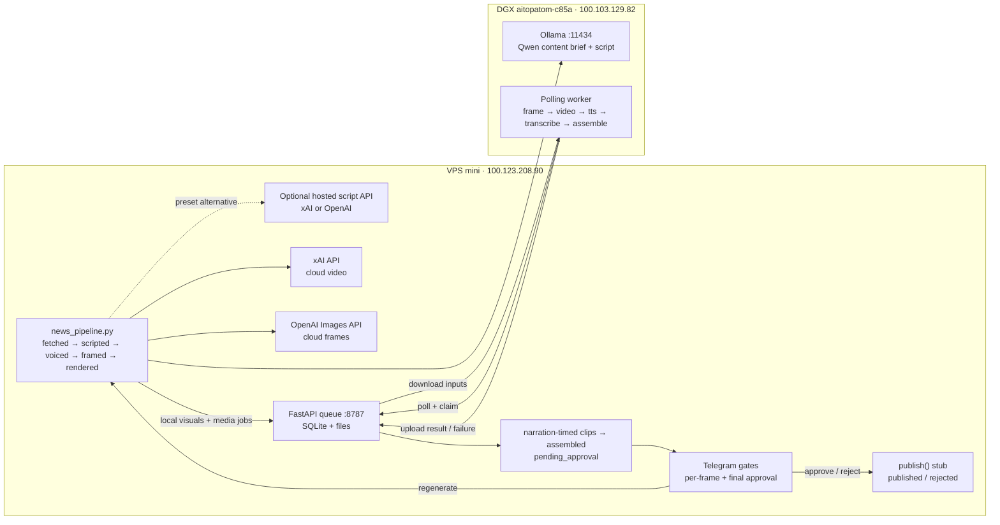

# Content Factory Architecture

## Machines and network

All service-to-service traffic stays inside the Tailscale tailnet
(`100.64.0.0/10`). Neither application service binds to a public interface.

| Machine | Role | Tailscale IPv4 |
| --- | --- | --- |
| `mini` | VPS control plane, model APIs, state, approval, and Web UI | `100.123.208.90` |
| `aitopatom-c85a` | DGX media worker | `100.103.129.82` |

The DGX worker makes outbound polling requests to the VPS. Its Ollama service
accepts script-provider requests from the VPS over Tailscale. The hosts
currently have a direct Tailscale path on the local network.

## Services and ports

| Host | Service | Bind/port | Purpose |
| --- | --- | --- | --- |
| VPS | `job-queue.service` | `100.123.208.90:8787` | FastAPI queue, SQLite state, input/result files |
| VPS | `hermes-webui.service` | `100.123.208.90:8788` | Hermes browser UI |
| VPS | `hermes-serve.service` | `100.123.208.90:9119` | Existing Hermes backend |
| DGX | worker process | outbound to VPS `:8787` | Local visuals, TTS, transcription, and assembly |
| DGX | Ollama | `100.103.129.82:11434` | Default OpenAI-compatible content brief and script provider |

UFW permits TCP 8787 and 8788 only from the Tailscale CGNAT range. External
xAI, OpenAI, and Telegram requests leave the VPS over HTTPS (TCP 443).

## Pipeline and job flow

SQLite in `pipeline/data/` records the pipeline state after every successful
stage. The queue has an independent SQLite store in `queue/data/`. A claimed
job that is not completed within 30 minutes automatically becomes `pending`
again. Claim tokens prevent an expired worker from completing a re-claimed job.

Local `frame` and `video` jobs plus `tts`, `transcribe`, and `assemble` cross
the tailnet queue boundary. Cloud visual mode sends frames to OpenAI and video
to xAI instead. Pipeline state and both approval gates remain on the VPS.

## Model roster

| Stage | Machine | Provider/model | Notes |
| --- | --- | --- | --- |
| Evergreen content brief | DGX via VPS | Ollama `qwen3.6:35b-a3b` | Default keyless OpenAI-compatible chat completions |
| Narration-timed script | DGX via VPS | Ollama `qwen3.6:35b-a3b` | Enough 4–6-second shots for the preset target duration; hosted provider optional |
| Frames (local default) | DGX | preset `flux2_klein` workflow | One I2V frame or first/last pair per shot |
| Frames (cloud) | VPS | OpenAI `gpt-image-1` | 9:16 images |
| Voiceover | DGX | worker-configured, pending sync | One persisted `tts` result per shot, generated before video |
| Video clips (local default) | DGX | worker-configured workflow | I2V or first/last-frame, narration + padding, Wan `4n+1` frames at 16fps |
| Video clips (cloud) | VPS | xAI `grok-imagine-video` | Narration-derived duration, capped by the preset |
| Captions | DGX + VPS | faster-whisper + ASS | Word timestamps become 2–3-word karaoke events on the VPS |
| Assembly | DGX + VPS | ffmpeg | DGX assembles and pads; VPS burns the ASS track with the subtitles filter; audio is never trimmed |

The script provider and local visual/assembly settings come from
`config/presets.yaml` and are snapshotted per run. Hosted script providers use
the optional configured key environment variable. Cloud visual models remain
environment-configurable and independent from the script provider.

## Deployment

The checked-in units under `deploy/systemd/` mirror
`~/.config/systemd/user/`. The queue unit points at this monorepo and starts
Uvicorn from `queue/.venv`. Hermes remains in `/home/alireza/hermes-webui` but
is pinned to the Tailscale address on port 8788.
