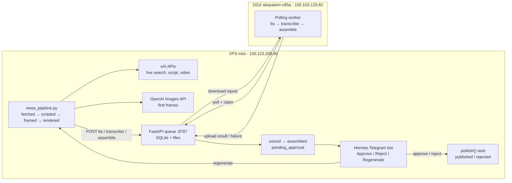

# Content Factory Architecture

## Machines and network

All service-to-service traffic stays inside the Tailscale tailnet
(`100.64.0.0/10`). Neither application service binds to a public interface.

| Machine | Role | Tailscale IPv4 |
| --- | --- | --- |
| `mini` | VPS control plane, model APIs, state, approval, and Web UI | `100.123.208.90` |
| `aitopatom-c85a` | DGX media worker | `100.103.129.82` |

The DGX makes outbound polling requests to the VPS; it needs no inbound worker
port. The hosts currently have a direct Tailscale path on the local network.

## Services and ports

| Host | Service | Bind/port | Purpose |
| --- | --- | --- | --- |
| VPS | `job-queue.service` | `100.123.208.90:8787` | FastAPI queue, SQLite state, input/result files |
| VPS | `hermes-webui.service` | `100.123.208.90:8788` | Hermes browser UI |
| VPS | `hermes-serve.service` | `100.123.208.90:9119` | Existing Hermes backend |
| DGX | worker process | outbound to VPS `:8787` | TTS, transcription, and assembly |

UFW permits TCP 8787 and 8788 only from the Tailscale CGNAT range. External
xAI, OpenAI, and Telegram requests leave the VPS over HTTPS (TCP 443).

## Pipeline and job flow

SQLite in `pipeline/data/` records the pipeline state after every successful
stage. The queue has an independent SQLite store in `queue/data/`. A claimed
job that is not completed within 30 minutes automatically becomes `pending`
again. Claim tokens prevent an expired worker from completing a re-claimed job.

Only `tts`, `transcribe`, and `assemble` cross the tailnet queue boundary.
Grok/OpenAI calls, pipeline state, and the approval gate remain on the VPS.

## Model roster

| Stage | Machine | Provider/model | Notes |
| --- | --- | --- | --- |
| Story discovery and scoring | VPS | xAI `grok-4.5` | Chat completions with live search |
| Five-shot script | VPS | xAI `grok-4.5` | Structured 50-second Shorts script |
| First frames | VPS | OpenAI `gpt-image-1` | One 9:16 image per shot |
| Video clips | VPS | xAI `grok-imagine-video` | Image-to-video, 10 seconds, 9:16 |
| Voiceover | DGX | worker-configured, pending sync | Queue type `tts` |
| Captions | DGX | worker-configured, pending sync | Queue type `transcribe` |
| Assembly | DGX | media toolchain, pending sync | Queue type `assemble`; no hosted model required |

The selected VPS models are environment-configurable. DGX model names remain
explicitly uncommitted until its worker files are synchronized.

## Deployment

The checked-in units under `deploy/systemd/` mirror
`~/.config/systemd/user/`. The queue unit points at this monorepo and starts
Uvicorn from `queue/.venv`. Hermes remains in `/home/alireza/hermes-webui` but
is pinned to the Tailscale address on port 8788.
