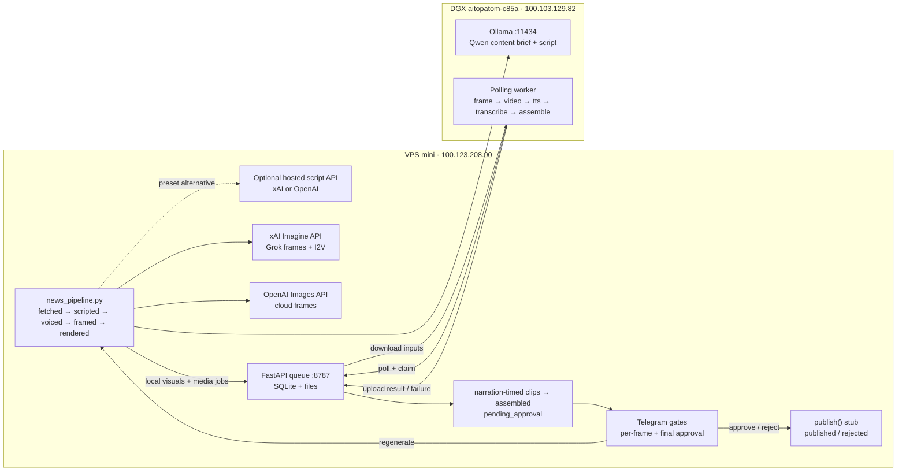

# Content Factory Architecture

## Machines and network

All service-to-service traffic stays inside the Tailscale tailnet
(`100.64.0.0/10`). Neither application service binds to a public interface.

| Machine | Role | Tailscale IPv4 |
| --- | --- | --- |
| `mini` | VPS control plane, model APIs, state, approval, and Web UI | `100.123.208.90` |
| `aitopatom-c85a` | DGX media worker | `100.103.129.82` |

The DGX worker makes outbound polling requests to the VPS. Its Ollama service
accepts script-provider requests from the VPS over Tailscale. The hosts
currently have a direct Tailscale path on the local network.

## Services and ports

| Host | Service | Bind/port | Purpose |
| --- | --- | --- | --- |
| VPS | `job-queue.service` | `100.123.208.90:8787` | FastAPI queue, SQLite state, input/result files |
| VPS | `hermes-webui.service` | `100.123.208.90:8788` | Hermes browser UI |
| VPS | `hermes-serve.service` | `100.123.208.90:9119` | Existing Hermes backend |
| DGX | worker process | outbound to VPS `:8787` | Local visuals, TTS, transcription, and assembly |
| DGX | Ollama | `100.103.129.82:11434` | Default OpenAI-compatible content brief and script provider |

UFW permits TCP 8787 and 8788 only from the Tailscale CGNAT range. External
xAI, OpenAI, and Telegram requests leave the VPS over HTTPS (TCP 443). xAI
Imagine requests run on the VPS; the OAuth bearer never crosses the tailnet.

## Pipeline and job flow

SQLite in `pipeline/data/` records the pipeline state after every successful
stage. The queue has an independent SQLite store in `queue/data/`. A claimed
job that is not completed within 30 minutes automatically becomes `pending`
again. Claim tokens prevent an expired worker from completing a re-claimed job.

Local `frame` and `video` jobs plus `tts`, `transcribe`, and `assemble` cross
the tailnet queue boundary. The queue is already bidirectional: the VPS stores
multipart job inputs, the DGX downloads them over Tailscale, the DGX uploads a
result, and the VPS downloads it. Grok therefore uses artifact-flow option A
without a new transport: frames stay on the VPS through Telegram approval,
the approved first frame feeds VPS-side Grok I2V, and the finished VPS clips
reuse the existing `assemble` input path to reach the DGX. No bearer-serving
endpoint or DGX token copy is introduced. Pipeline state and both approval
gates remain on the VPS.

## Model roster

| Stage | Machine | Provider/model | Notes |
| --- | --- | --- | --- |
| Evergreen content brief | DGX via VPS | Ollama `qwen3.6:35b-a3b` | Default keyless OpenAI-compatible chat completions |
| Narration-timed script | DGX via VPS | Ollama `qwen3.6:35b-a3b` | Enough 4–6-second shots for the preset target duration; hosted provider optional |
| Frames (local default) | DGX | preset `flux2_klein` workflow | One I2V frame or first/last pair per shot |
| Frames (OpenAI) | VPS | OpenAI `gpt-image-1` | 9:16 images |
| Frames (Grok) | VPS | xAI `grok-imagine-image` | Requested as 9:16 and center-cropped/upscaled to the local 1080x1920 PNG contract |
| Voiceover | DGX | worker-configured, pending sync | One persisted `tts` result per shot, generated before video |
| Video clips (local default) | DGX | worker-configured workflow | I2V or first/last-frame, narration + padding, Wan `4n+1` frames at 16fps |
| Video clips (`xai_key`) | VPS | xAI model from `XAI_VIDEO_MODEL` | Existing API-key path; narration-derived duration, capped by the preset |
| Video clips (Grok) | VPS | xAI `grok-imagine-video-1.5` | I2V from the approved first frame; fixed-length results are video-only padded/trimmed to narration-derived timing |
| Captions | DGX + VPS | faster-whisper + ASS | Word timestamps become 2–3-word karaoke events on the VPS |
| Assembly | DGX + VPS | ffmpeg | DGX assembles and pads; VPS burns the ASS track with the subtitles filter; audio is never trimmed |

The script provider and visual/assembly settings come from
`config/presets.yaml` and are snapshotted per run. `frames_provider` accepts
`local|openai|grok`; `video_provider` accepts `local|xai_key|grok`. Both default
to `local`. `--visuals local`, `--visuals grok`, and `--visuals cloud` expand to
`local/local`, `grok/grok`, and `openai/xai_key`; individual provider flags win
over the shorthand. Grok video is single-frame I2V, so the explicit
`video_mode=flf` combination fails during pre-flight (`auto` is constrained to
I2V for this provider). `imagine_call_cap` persists a per-run ceiling, default
40, across retries and frame regenerations.

Grok OAuth is subscription-backed (SuperGrok or X Premium+) rather than an API
key account. Framegate reads the bearer from the same Hermes `xai-oauth` grant
when `XAI_API_KEY` is absent. The access is strictly read-only: Framegate never
refreshes, rotates, or writes Hermes' `auth.json`; an expired or missing token
fails startup and asks the operator to re-authenticate in Hermes. Hermes' home
and profile path rules are mirrored, with `HERMES_AUTH_PATH` available as an
explicit path override.

## Deployment

The checked-in units under `deploy/systemd/` mirror
`~/.config/systemd/user/`. The queue unit points at this monorepo and starts
Uvicorn from `queue/.venv`. Hermes remains in `/home/alireza/hermes-webui` but
is pinned to the Tailscale address on port 8788.
